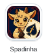
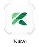
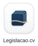
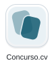

# Rui Andrade

**Software developer building digital products for Cabo Verde and its diaspora.**

[Português](README.pt.md) · [Atum Fresku](https://atumfresku.cv/) · [RA Tecnologias](https://ratecnologias.cv/) · [LinkedIn](https://www.linkedin.com/in/ruibarrosandrade/)

I'm a Cape Verdean software developer. I build products that connect people with the things they need: a card game to play with friends, software to run a clinic, or an easier way to find local information.

My work spans web and mobile interfaces, backend services and deployment. These are seven of the products I build.

## Selected products

  <a href="https://spadinha.cv/"><picture><source media="(prefers-color-scheme: dark)" srcset="assets/dock/spadinha-dark.svg"></picture></a>
  <a href="https://kuraclinic.cv/"><picture><source media="(prefers-color-scheme: dark)" srcset="assets/dock/kura-dark.svg"></picture></a>
  <a href="https://legislacao.cv/"><picture><source media="(prefers-color-scheme: dark)" srcset="assets/dock/legislacao-dark.svg"></picture></a>
  <a href="https://azaguas.cv/"><picture><source media="(prefers-color-scheme: dark)" srcset="assets/dock/azaguas-dark.svg"></picture></a>
  <a href="https://kabuverdi.cv/"><picture><source media="(prefers-color-scheme: dark)" srcset="assets/dock/kabuverdi-dark.svg"></picture></a>
  <a href="https://concurso.cv/"><picture><source media="(prefers-color-scheme: dark)" srcset="assets/dock/concurso-dark.svg"></picture></a>
  <a href="https://fresku-ai.vercel.app/"><picture><source media="(prefers-color-scheme: dark)" srcset="assets/dock/fresku-ai-dark.svg"></picture></a>

| Product | What it does |
| --- | --- |
| **[Spadinha](https://spadinha.cv/)** | The Cape Verdean card game on mobile, with solo play and online rooms for friends. |
| **[Kura](https://kuraclinic.cv/)** | Clinical software bringing appointments, patient records and billing together. |
| **[Legislacao.cv](https://legislacao.cv/)** | Search and explore Cabo Verde's legislation with references to the source documents. |
| **[Azaguas](https://azaguas.cv/)** | Weather, sea conditions and environmental alerts for the islands. |
| **[Kabu Verdi](https://kabuverdi.cv/)** | News, civic information and events from across Cabo Verde. |
| **[Concurso.cv](https://concurso.cv/)** | Public and private tenders in one place, with search, deadlines and procedure status. |
| **[Fresku AI](https://fresku-ai.vercel.app/)** | Applied AI across the Atum Fresku products, from healthcare and legislation to news and climate. |

## Behind the products

- **Games and mobile:** TypeScript, Three.js, Node.js, WebSockets and Capacitor in Spadinha. [Product and technical overview](https://github.com/OAtumFresco/spadinha-showcase).
- **Clinical software:** React, TypeScript, Java, Spring Boot and PostgreSQL in Kura. [Product and technical overview](https://github.com/OAtumFresco/kura-showcase).
- **Web platforms:** Next.js and React across my web projects.

The showcase repositories document the products and selected engineering decisions. Application source code remains private.

## Let's connect

Found me through one of these products? I'd like to hear how you use it. I'm also interested in connecting with other Cape Verdeans building technology, at home and across the diaspora.

[LinkedIn](https://www.linkedin.com/in/ruibarrosandrade/) · [Contact through RA Tecnologias](https://ratecnologias.cv/#contacto) · [More work at Atum Fresku](https://atumfresku.cv/)
